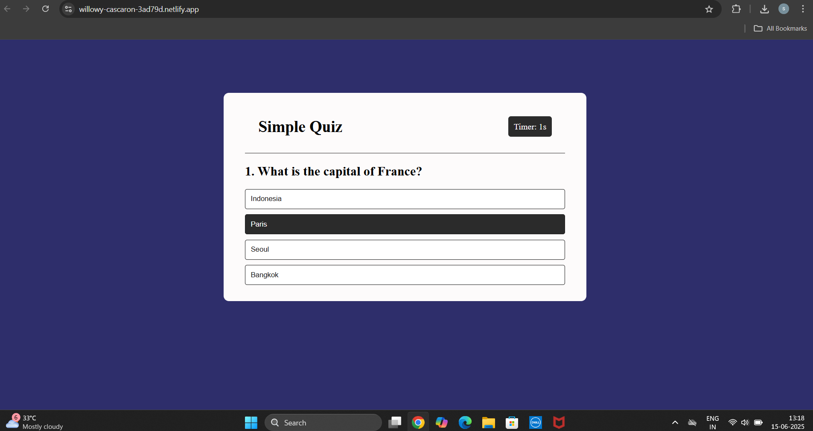
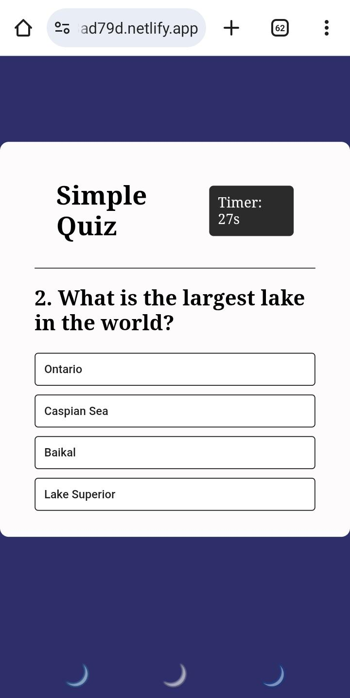

📌  A fun and responsive Quiz App built with HTML, CSS, and JavaScript.
    Users can answer multiple-choice questions, receive instant feedback, and view their final score at the end.
    Designed for both desktop and mobile users.

-----

## 🎯 Features

- 📊 Live score tracking
- ✔️ Immediate feedback on correct or wrong answers
- 🔄 Option to restart the quiz
- 🎨 Responsive layout (mobile & desktop)
    
-----

## 🔗 Live Demo

Play it here 👉 [https://willowy-cascaron-3ad79d.netlify.app]

-----

## 🖼 Screenshots

### 🖥 Desktop View  

### 📱 Mobile View  

-----

## 🛠 Tech Stack

- HTML5
- CSS3 (Flexbox & Grid)
- JavaScript (DOM, event handling)
